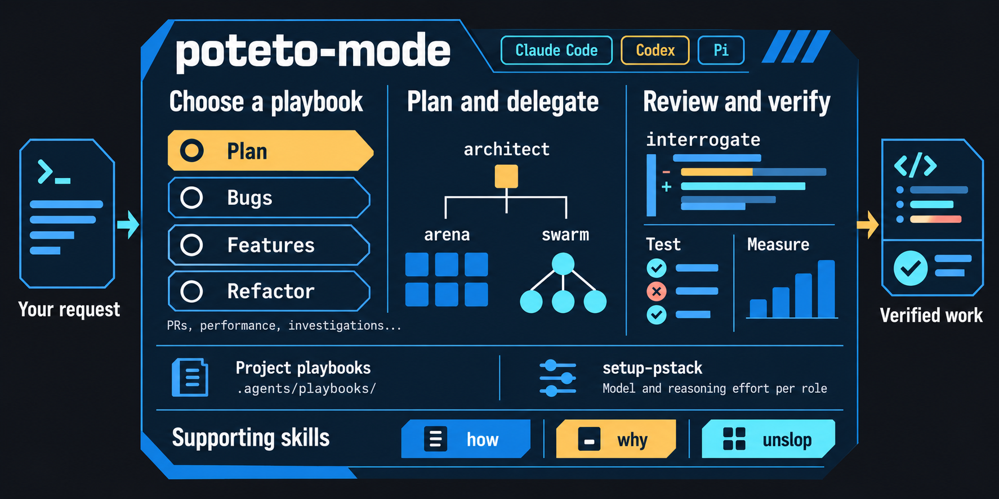

# pstack-mod

[日本語](README.md) | [English](README.en.md)

pstack-mod は、Lauren Tan の [pstack](https://github.com/cursor/plugins/tree/main/pstack) を、[Michael Denyer の移植版](https://github.com/michael-denyer/pstack-claude)を基に Codex と Claude Code 向けに調整した、takahudi の個人用プラグインです。設計・実装・検証・レビューの作業手順をまとめ、両環境で `pstack-mod` の名前空間を使います。上流のスキルと独自の調整は、[フォークの記録](tools/forks.json)と[設計メモ](docs/PSTACK_MOD_DESIGN.md)で区別しています。

`pstack-mod:poteto-mode` に作業の目的を伝えると、内容に合った手順で調査・実装・検証を進めます。

## インストール

### Claude Code

Claude Code 内で、GitHub リポジトリをマーケットプレイスとして登録し、プラグインをインストールします。

```text
/plugin marketplace add takahudi/pstack-mod
/plugin install pstack-mod@pstack-mod
```

### Codex

ターミナルで実行します。

```shell
codex plugin marketplace add takahudi/pstack-mod
codex plugin add pstack-mod@pstack-mod
```

インストール後は新しいセッションを開始し、`pstack-mod:setup-pstack` で各環境のモデルや推論の強さを設定します。自動ルーティングの初期状態は無効です。各環境の `pstack-mod-models.md` に `session hook: on` を明示すると有効になり、モデル設定の更新時もその選択を保持します。任意フックの実行には PATH 上の Node.js 18 以降が必要です。Codex では `/hooks` での信頼確認も必要です。旧プラグインから切り替える場合は、[移行・更新・ロールバックの手順](docs/LOCAL_INSTALL.md)を確認してください。

Matt Pocock のスキルは別プラグインとして使います。たとえば、設計には `pstack-mod:architect`、Matt のレビューには `mattpocock-skills:code-review` を指定できます。名前空間を保つため、両方を使う場合はプラグインとしてのインストールを推奨します。

Prime Agent、OpenCode、Gemini CLI、またはスキルだけを導入する場合は、[共通の導入手順](docs/reference.md#shared-skills-installation)を参照してください。

### ローカルの作業フォルダから試す

Claude Code では、このフォルダから一時的なセッションを開始できます。

```shell
claude --plugin-dir ./plugins/pstack
```

Codex でローカル版を使う場合は、GitHub の代わりにこのフォルダを登録します。

```shell
codex plugin marketplace add .
codex plugin add pstack-mod@pstack-mod
```

## 使い方

```text
pstack-mod:poteto-mode を使って、ページを切り替えると検索条件がリセットされる不具合を修正してください。
```

不具合の修正では、問題を再現し、`how` と `why` で原因を調べ、修正後に同じ操作で結果を確認します。他の関数にも影響する変更では、実装前に `architect` で設計を検討します。完了時には、変更内容と検証結果を報告します。

[その他の作業手順](plugins/pstack/skills/poteto-mode/SKILL.md#playbooks)には、計画、機能追加、リファクタリング、性能改善、調査、試作、PR の保守、長期の作業などがあります。



## 詳しい資料

- [スキルと呼び出し方](docs/reference.md#slash-commands)
- [実行環境ごとの設定](docs/reference.md#runtime-support)
- [モデルと依存ツール](docs/reference.md#configuration-and-dependencies)
- [保守方針と移植範囲](docs/reference.md#maintenance)

## データの扱い

pstack-mod 自体にはサーバーや利用状況の送信機能はありません。セッションの記録など、スキルがエージェントに読ませる内容は、利用しているモデルの提供元へ送られます。スクリプトはローカルで動作し、PR 関連のツールは GitHub CLI のログイン情報を使います。

## 開発への参加

変更を加える場所や検証方法は [CONTRIBUTING.md](CONTRIBUTING.md) を参照してください。脆弱性の報告方法は [SECURITY.md](SECURITY.md) に記載しています。

## ライセンス

この移植版は、上流の [MIT ライセンス](LICENSE)と著作権表記を保持しています。Michael Denyer の移植版は © 2026 Michael Denyer、元の pstack は © 2026 Lauren Tan、取り込んだ cursor-team-kit のスキルは © 2026 Cursor です。[LICENSE-cursor-team-kit](LICENSE-cursor-team-kit) と [NOTICE.md](NOTICE.md) も参照してください。
